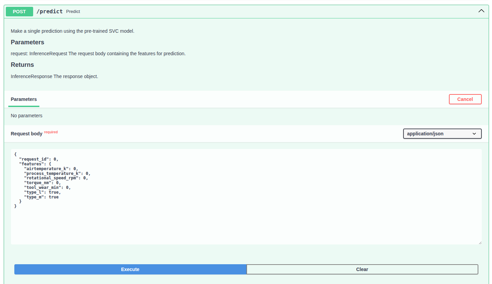
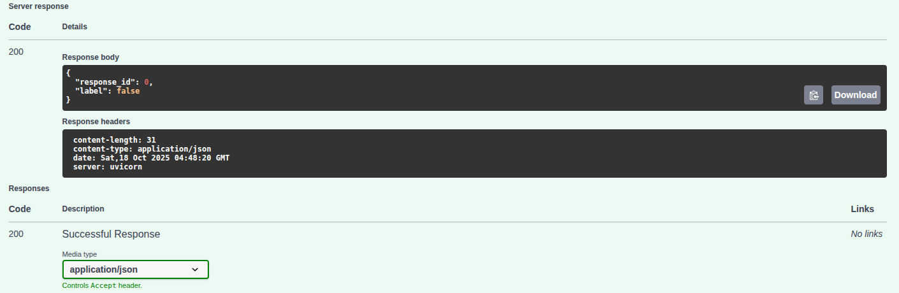
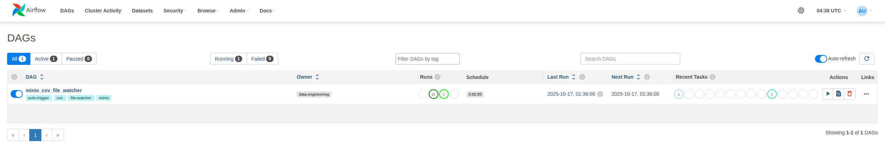
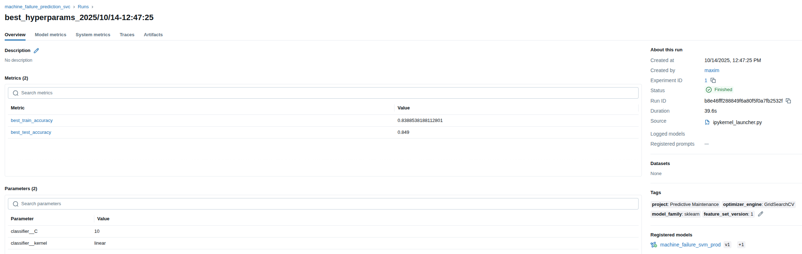
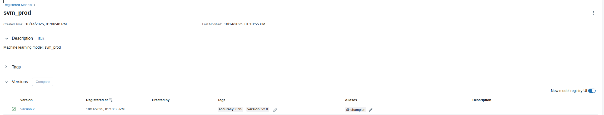
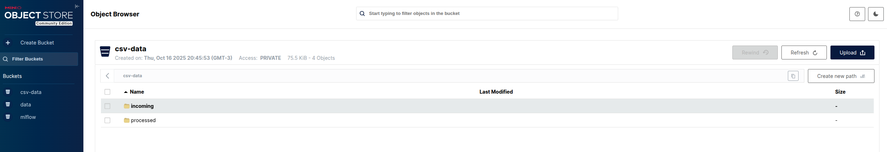

# Trabajo Practico final de la asignatura Operaciones de Aprendizaje Automatico

### Alumno: Maxim Dorogov

Proyecto de referencia: https://github.com/facundolucianna/amq2-service-ml/


## Descripcion del proyecto

Este proyecto implementa un sistema para la predicción de fallas en máquinas usando algoritmos de Support Vector Machine (SVM). La solución incluye el entrenamiento y registro de modelos en MlFlow, la implementación de una API para inferencia, despliegue y persistencia del modelo y su metadata (archivo serializado y métricas) y un sistema de orquestación para la ingesta y procesamiento de datos mediante Apache Airflow. La persistencia de datos se realiza utilizando bases de datos y buckets de AWS S3 (MinIO).

## Estructura del proyecto y componentes principales:

### **notebooks/**

Notebook Jupyter (`notebooks/experiment.ipynb`) para experimentación con modelos de machine learning. En esta notebook se realizan las siguientes tareas:

- Preprocesamiento de datos con pipelines de scikit-learn
- Entrenamiento de modelos SVM para clasificación de fallas en máquinas
- Búsqueda de hiperparámetros usando GridSearchCV
- Evaluacion y registro de modelos y experimentos en MLflow.

### **mlflow/**

- Servicio de MLflow para tracking y gestión de modelos.

### **inference_api/**

La api fue desarrollada con FastAPI y esta compuesta por un endpoint de inferencia para predicción de fallas en máquinas y un endpoint de health check. Durante el proceso de inicialización, se intenta cargar el modelo "champion" desde el MLflow Model Registry. Si la conexión falla, o el modelo es inexistente, utiliza un modelo local, incluido en la imagen de docker, como respaldo.

### Endpoints

- `/predict`: El endpoint acepta un JSON con las características de funcionamiento de la máquina y devuelve una predicción indicando si se espera una falla o no.
- `/`: Devuelve un JSON con el estado de la API.

### **airflow/**

Sistema de orquestación de flujos de trabajo usando Apache Airflow. El DAG definido en `airflow/dags/csv_file_watcher.py.py` realiza las siguientes tareas:

- Monitorea el bucket `csv-data/incoming/` a la espera de nuevos archivos CSV con datos de mediciones.
- Procesa los archivos nuevos, aplicando transformaciones y limpieza de datos.
- Mueve los archivos procesados a un nuevo bucket `csv-data/processed/`.

Funcionamiento del DAG:

- Paso 1: Nuevo archivo agregado a `csv-data/incoming/`
```sh
csv-data/
├── incoming/
│   └── measurements_2025_10_14.csv   ← agregado externamente
└── processed/
                                      ← vacio inicialmente
```
- Paso 2: Archivo procesado y movido a `csv-data/processed/`
```sh
csv-data/
├── incoming/
│                                     ← queda vacio despues del procesamiento
└── processed/
    └── measurements_2025_10_14.csv   ← movido por el dag al finalizar el procesamiento
```

## Requisitos del sistema
- Ubuntu 22.04.5 LTS
- Docker Engine v27.3.1
- Docker Compose v2.29.7
>NOTA: El proyecto podria funcionar en otros sistemas basados en Linux y versiones anteriores de docker y docker compose.

## Setup

Ejecutar desde la raiz del proyecto:

```sh
docker compose -f docker-compose.yml up --build
```

El sistema demora unos minutos en inicializarse completamente, ya que debe construir las imagenes de docker y levantar todos los servicios (MLflow, Airflow, MinIO, API de inferencia). Se puede monitorear el estado de los contenedores con:

```sh
docker ps
```
Una vez inizializados los contenedores, se mostraran con como UP o Healty en la columna de  status:

```sh
ONTAINER ID   IMAGE                       COMMAND                  CREATED        STATUS                   PORTS                                                                                      NAMES
1c5ba72eb478   fiuba-mlops-scheduler       "/usr/bin/dumb-init …"   27 hours ago   Up 3 minutes (healthy)   8080/tcp                                                                                   fiuba-mlops-scheduler-1
5bdb23d79e1f   fiuba-mlops-webserver       "/usr/bin/dumb-init …"   27 hours ago   Up 3 minutes (healthy)   0.0.0.0:8080->8080/tcp, :::8080->8080/tcp                                                  fiuba-mlops-webserver-1
0e7ad9a71a00   fiuba-mlops-inference_api   "uvicorn src.main:ap…"   28 hours ago   Up 2 minutes             0.0.0.0:8000->8000/tcp, :::8000->8000/tcp                                                  fiuba-mlops-inference_api-1
05ab82065344   fiuba-mlops-mlflow          "mlflow server --bac…"   28 hours ago   Up 3 minutes (healthy)   0.0.0.0:5000->5000/tcp, :::5000->5000/tcp                                                  mlflow
7e355ee106cb   fiuba-mlops-postgres        "docker-entrypoint.s…"   28 hours ago   Up 4 minutes (healthy)   0.0.0.0:5432->5432/tcp, :::5432->5432/tcp                                                  postgres
ac2e2426001f   minio/minio:latest          "/usr/bin/docker-ent…"   28 hours ago   Up 4 minutes (healthy)   0.0.0.0:9010->9000/tcp, [::]:9010->9000/tcp, 0.0.0.0:9011->9001/tcp, [::]:9011->9001/tcp   minio
```

## Acceso a los servicios

- **API de inferencia (documentacion swagger): http://localhost:8000/docs**

Desde la documentacion se puede probar el endpoint de inferencia `/predict` enviando un JSON con las caracteristicas de la maquina. 

Ejemplo de `POST` request:


Respuesta de la API:



- **Airflow Webserver UI: http://localhost:8080**
  - Usuario: `admin`
  - Contraseña: `admin`

En el panel de Airflow, se puede monitorear el DAG `csv_file_watcher` y su ejecución.



- **MLflow Tracking UI: http://localhost:5000**

Durante las pruebas se entreno un modelo desde `notebooks/experiment.ipynb` y se registro un experimento de busqueda de hiperparametros para un clasificador SVM:



Tambien se almaceno el modelo entrenado para dejarlo accesible desde la API de inferencia:



Para probar el funcionamiento de MlFlow se puede ejecutar la jupyter notebook que se encuentra en `notebooks/experiment.ipynb`. Esto entrena un modelo y registra, tanto el modelo como los hiperparametros junto con metricas de entrenamiento, en el servidor de MlFlow. Luego de esto es necesario reiniciar el servicio de `inference_api` para que el modelo este disponible en el endpoint de inferencia:

```sh
docker compose restart inference_api
```
>NOTA: Se recomienda instalar los requirements de `inference_api/requirements.txt` en la computadora donde tengan alojado su jupyter server para evitar tener problemas de incompatibilidad.

- **MinIO Web UI: http://localhost:9010**
    - Usuario: `admin`
    - Contraseña: `12345678`

En el panel de administracion de MinIO se veran los buckets creados y los datos almacenados. Para probar el funcionamiento del DAG se puede subir un archivo CSV manualmente a `csv-data/incoming/` y al cabo de unos minutos lo vera procesado en `csv-data/processed`



>NOTA: Las credenciales de acceso a los servicios son para fines de desarrollo y pruebas. En un entorno de producción, se deben utilizar credenciales seguras y mecanismos de autenticación adecuados.

## Mejoras y trabajos futuros

Algunas posibles mejoras para el proyecto:
- Implementar un endpoint de actualización del modelo en la API de inferencia para permitir la carga dinámica de nuevos modelos desde MLflow.
- DAG para entrenamiento de modelos y registro del modelo `champion` en MLflow ante la llegada de nuevos datos.
- Autenticacion mediante OAuth2 o JWT para la API de inferencia.
- Parametrizar el DAG de airflow (file watcher) para permitir la configuracion dinamica de buckets y prefijos.
- Mantener las imagenes creadas en un registry versionando cada build y referenciando la url en el archivo de compose en la etapa de deployment.